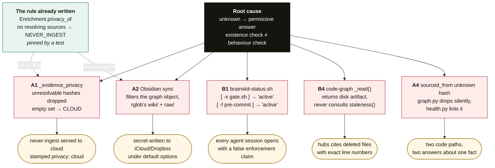
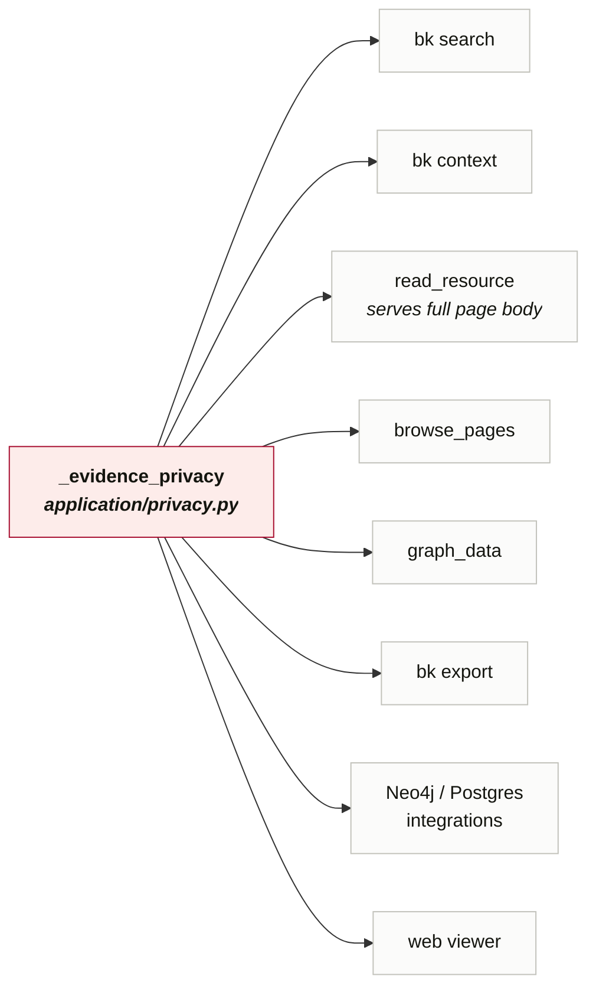
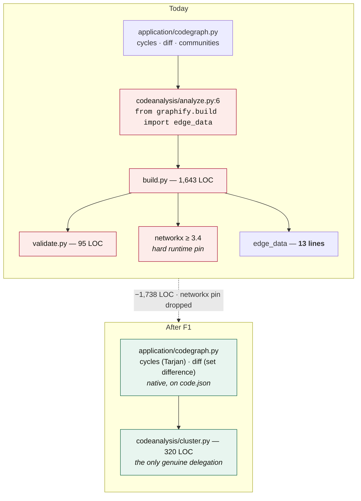
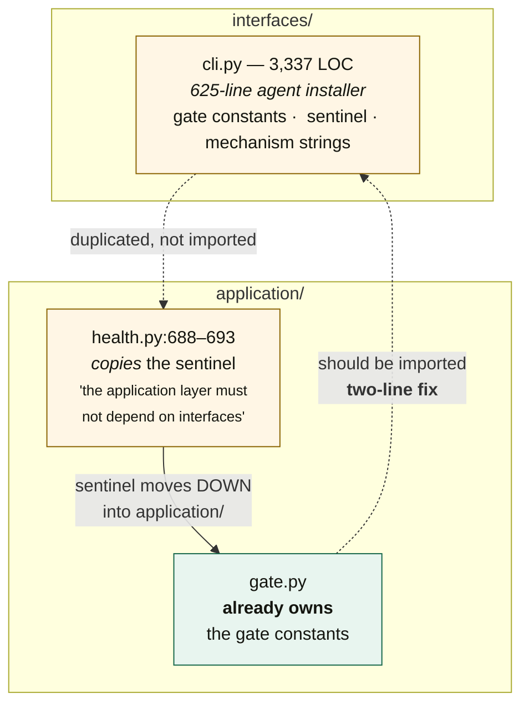

<!-- Stage 03. Architecture diagrams for the remediation programme. -->

# Architecture — where the fail-open pattern lives

> Written as Mermaid rather than `.excalidraw`: these are dependency and
> decision-flow diagrams, which Mermaid renders losslessly and reviewably in a
> diff. Use `/diagram architecture` if a hand-editable Excalidraw canvas is
> wanted for a presentation.

## 1. The one root cause, five surfaces

Every P0/P1 finding is the same mistake at a different altitude: an unknown
resolved permissively, or an existence check standing in for a behaviour check.

## 2. Blast radius of A1 — one helper, every consumer-scoped read

`_evidence_privacy` is shared. Fixing it once closes every path below; leaving it
open means each path is independently wrong.

## 3. Track F — the tier above the vendored tree

The extractors are healthy and stay. The cost is the *analysis tier* importing
a 1,643-line module at load time to reach a 13-line helper.

## 4. Track F3 — the triplicated installer contract

The layering rule is right; the response to it was to copy rather than move.
Writer and readers can silently disagree about what "installed" means — and per
this repo's history, that divergence has already shipped twice.

## 5. Phase gates

```mermaid
flowchart LR
    P1["<b>Phase 1</b><br/>A1 A2 B1 B2 C1<br/><i>stop the leak</i>"]
    P2["<b>Phase 2</b><br/>A3 A4 A5 B4 D1 D2 D3<br/>E1 E2 E3 C2<br/><i>honest answers + way in</i>"]
    P3["<b>Phase 3</b><br/>F1 F2 F3 F4 B3 E4 E5 G2<br/><i>architecture</i>"]
    P4["<b>Phase 4</b><br/>G1 G3 G4 F5 C3 C4<br/><i>docs truth + release</i>"]
    REL(["brainskit 0.6.0<br/>on PyPI"])

    P1 --> GATE1{{"suite green · ruff clean<br/>bk lint clean<br/><b>negative controls shown</b>"}} --> P2
    P2 --> GATE2{{"same gate"}} --> P3
    P3 --> GATE3{{"same gate"}} --> P4
    P4 --> GATE4{{"same gate<br/>+ version single-sourced"}} --> REL

    classDef phase fill:#fbfbfa,stroke:#14150f,color:#14150f
    classDef gate fill:#f1f1ef,stroke:#d9421c,color:#14150f
    classDef rel fill:#e8f5ef,stroke:#16674a,color:#14150f
    class P1,P2,P3,P4 phase
    class GATE1,GATE2,GATE3,GATE4 gate
    class REL rel
```

---
<!-- doc-tracking -->
- Created: 2026-08-12
- Updated: 2026-08-12 10:07
- Updated: 2026-08-12 10:08
