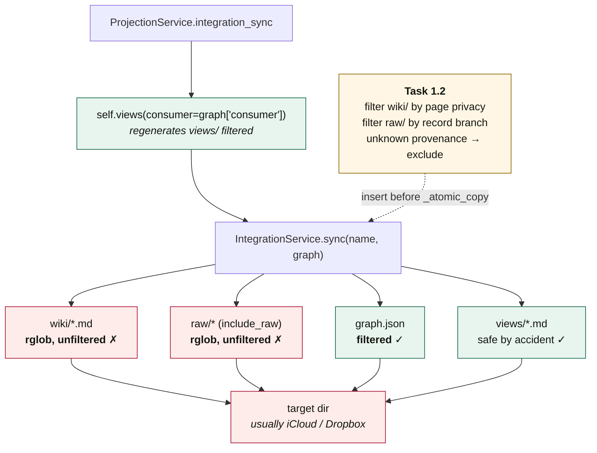
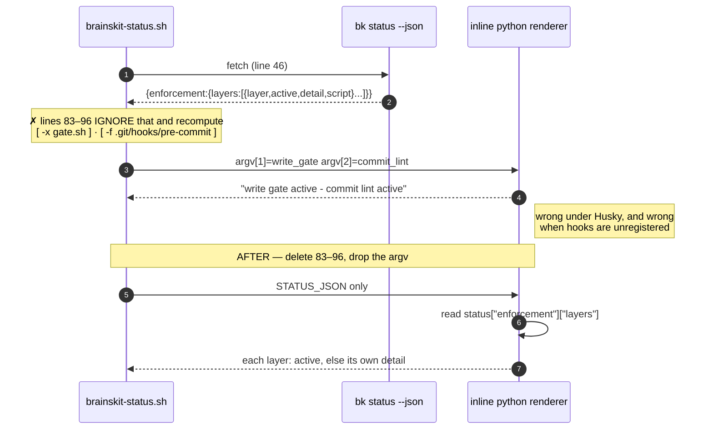
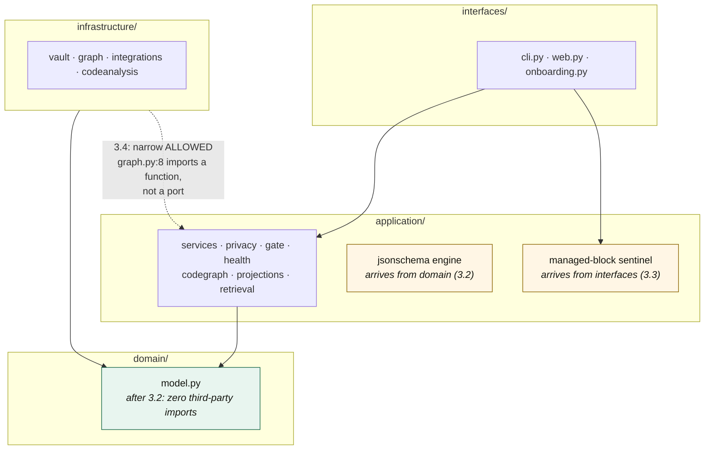
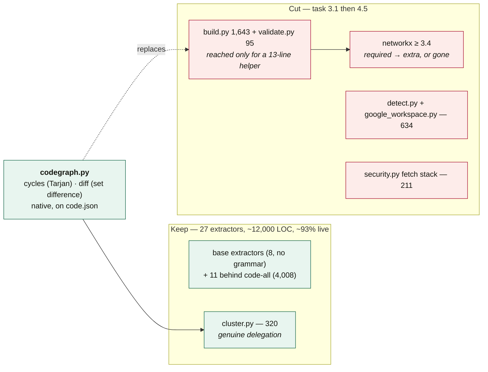

<!-- Stage 03. Component relationships and key flows for 02-spec.md. -->

# Components — what each task touches

Companion to [`../02-spec.md`](../02-spec.md). The last section is the one to read
before dispatching parallel work.

## 1. The leak path — task 1.1, before and after

```mermaid
sequenceDiagram
    autonumber
    participant A as agent / bk search
    participant R as retrieval.py
    participant P as _evidence_privacy
    participant REG as registry

    Note over A,REG: BEFORE — the hash no longer resolves
    A->>R: search(consumer="cloud")
    R->>P: (hit, content, records, config)
    P->>REG: sources = [h1]; is h1 in records?
    REG-->>P: no
    P->>P: generator filters it out → empty
    P-->>R: strictest_privacy(∅) = CLOUD
    R-->>A: count=1 · redacted=0 · privacy="cloud"
    Note right of A: never-ingest body served,<br/>and affirmatively mislabelled

    Note over A,REG: AFTER — task 1.1
    A->>R: search(consumer="cloud")
    R->>P: (hit, content, records, config)
    P->>REG: sources = [h1]; is h1 in records?
    REG-->>P: no
    P->>P: declared sources, none resolve<br/>→ unknown provenance
    P-->>R: NEVER_INGEST
    R-->>A: count=0 · redacted=1
```

The rule in the "after" path is not new — `Enrichment.privacy_of` already
implements it and is pinned by a test. Task 1.1 is making one caller agree with
the other.

## 2. The Obsidian sync path — task 1.2

`views/` is safe **by accident**: it is regenerated filtered just before the copy.
Nothing regenerates `wiki/` or `raw/`.



## 3. The honest-status path — task 1.3

The shell already holds the correct answer and throws it away.



## 4. Dependency direction — tasks 3.2, 3.3, 3.4



## 5. The vendored tier — task 3.1



## 6. File ownership — read before dispatching parallel agents

Tasks that share a file must go to **one** agent, or run in sequence. Collisions
below are real, not hypothetical.

| File | Tasks | Rule |
|---|---|---|
| `application/privacy.py` | **1.1, 2.3, 2.8** | One agent, in that order. 2.3 depends on 1.1's shape; 2.8 is a separate function but the same file. |
| `infrastructure/integrations.py` | **1.2, 2.10, 3.8** | Different phases — safe in sequence, never concurrent. |
| `application/codegraph.py` | **2.4, 3.1, 3.7** | 3.7 blocked by 2.4. 3.1 touches a different region; still one agent. |
| `interfaces/cli.py` | **1.4, 2.5, 3.3, 4.2, 4.3, 4.4** | The busiest file in the plan (3,337 LOC). Serialise by phase. |
| `tests/test_fix_services.py` | **1.1, 2.3, 2.8, 2.9** | Same agent as `privacy.py`, plus 2.9. |
| `tests/test_fix_integrations.py` | **1.2, 2.10, 3.8** | Follows `integrations.py`. |
| `tests/test_layering.py` | **3.2, 3.3, 3.4** | One agent for the whole layering slice. |
| `pyproject.toml` | **1.5, 3.1, 4.6** | Different keys, different phases. Never concurrent. |
| `.github/workflows/release.yml` | **1.5, 2.11, 4.6** | Sequential by definition. |

**Safe to parallelise within Phase 1:** `1.3` (shell template + `test_enforcement_status.py`)
and `1.4` (`gate.py` + `test_gate.py`) are disjoint from `1.1`/`1.2` and from each
other. `1.5` touches `pyproject.toml` and `release.yml` only.

**Contract edits belong to the orchestrator.** Where a task changes a signature two
other tasks code against — `strictest_privacy` in 2.3, `_read` in 2.4 — land that
signature change first, centrally, then dispatch against the fixed interface.

---
<!-- doc-tracking -->
- Created: 2026-08-12
- Updated: 2026-08-12 10:21
